# Next-Generation SIEM Platform: Proactive Defense & Risk-Based Alerting

## Executive Summary

As cyber threats become increasingly sophisticated, traditional Security Information and Event Management (SIEM) systems often paralyze Security Operations Centers (SOCs) with overwhelming alert fatigue. Security analysts are frequently bombarded with thousands of low-level, uncontextualized alerts, leading to delayed response times and a heightened risk of missing critical incidents. This project aims to address these critical inefficiencies by engineering a modern, proactive SIEM platform designed around Risk-Based Alerting (RBA) and automated threat containment.

Instead of relying solely on rigid, signature-based detections that trigger independently, this platform contextualizes events by correlating them against a dynamic asset criticality framework and live threat intelligence feeds. By calculating a holistic Risk Score for each entity, the system intelligently escalates only the most severe, high-confidence threats to the L3 Analysts, drastically reducing false positives and operational noise.

Furthermore, the platform moves beyond passive monitoring by integrating a Wazuh-inspired Active Response (SOAR) capability. When critical thresholds are breached—such as the detection of ransomware behavior or rapid lateral movement—the system can autonomously isolate compromised endpoints, sever malicious connections, and execute pre-defined defensive playbooks, closing the crucial gap between detection and mitigation.

## Architecture Diagram

```mermaid
flowchart LR
    %% Data Sources Layer
    subgraph Sources ["Data Sources"]
        direction TB
        Win["Windows (Sysmon)"]
        Cloud["Cloud Logs"]
        Net["Network Appliances"]
    end

    %% Ingestion Layer
    subgraph Ingestion ["Ingestion Layer"]
        direction TB
        API["FastAPI Ingestion API"]
        Redis[("Redis Queue (Buffer)")]
    end

    %% Processing Layer
    subgraph Processing ["Processing Layer"]
        direction TB
        Enrich["Log Enrichment Pipeline<br/>(GeoIP & Live Threat Intel)"]
        Norm["ECS Normalization Worker"]
        RBA["Detection Engine<br/>(Risk-Based Alerting)"]
    end

    %% Storage Layer
    subgraph Storage ["Storage"]
        ES[("Elasticsearch<br/>(Hot/Cold Storage)")]
    end

    %% Presentation Layer
    subgraph Presentation ["Presentation Layer"]
        direction TB
        Dash["React Dashboard<br/>(Log Explorer)"]
        Geo["Global Geo-Threat Map"]
        SOAR["Incident Response<br/>(Active Response)"]
    end

    %% Primary Data Flow
    Win & Cloud & Net -- "Raw JSON Logs" --> API
    API --> Enrich
    Enrich -- "Appends Meta-Data" --> Redis
    Redis -- "Queue Pop" --> Norm
    Norm -- "Indexes Standardized Data" --> ES
    
    %% Detection Flow
    ES -- "Batch Queries" --> RBA
    RBA -- "Risk Alerts" --> Dash

    %% Presentation Flow
    ES --> Dash
    ES --> Geo
    Dash --- SOAR

    %% SOAR Feedback Loop
    SOAR -- "Active Response / Containment Command" --> Sources

    %% Styling
    classDef source fill:#1e293b,stroke:#64748b,stroke-width:2px,color:#fff;
    classDef ingest fill:#0f172a,stroke:#3b82f6,stroke-width:2px,color:#fff;
    classDef process fill:#0f172a,stroke:#10b981,stroke-width:2px,color:#fff;
    classDef storage fill:#0f172a,stroke:#f59e0b,stroke-width:2px,color:#fff;
    classDef ui fill:#1e293b,stroke:#8b5cf6,stroke-width:2px,color:#fff;
    classDef soar fill:#7f1d1d,stroke:#ef4444,stroke-width:2px,color:#fff;

    class Win,Cloud,Net source;
    class API,Redis ingest;
    class Enrich,Norm,RBA process;
    class ES storage;
    class Dash,Geo ui;
    class SOAR soar;
```



## Key Features & Innovations

### Risk-Based Alerting (RBA)
We shifted the paradigm from traditional, noisy signature-based alerts to a dynamic Risk-Based Alerting engine. Every incoming log is evaluated against an asset criticality matrix (`assets.json`) and specific MITRE ATT&CK tactics. Alerts are only generated and escalated to analysts when the compounded Risk Score of an entity exceeds a critical threshold, effectively eliminating alert fatigue.

### File Integrity Monitoring (FIM)
The platform actively monitors critical configuration files and sensitive directories. Unauthorized modifications, deletions, or access attempts are immediately flagged, ensuring that core system integrity is protected against stealthy tampering and ransomware activity.

### Active Response (SOAR Capabilities)
Inspired by industry leaders like Wazuh, the platform integrates automated containment capabilities. When a severe threat is validated (e.g., active privilege escalation or lateral movement), analysts can trigger immediate, automated active responses directly from the dashboard—such as isolating hosts or blocking IPs—to stop attackers in their tracks.

### Data Enrichment Pipeline
To provide maximum context to the detection engine, the ingestion pipeline intercepts all logs before indexing and normalizes them into the **Elastic Common Schema (ECS)**. Simultaneously, the pipeline pulls a live, daily Threat Intelligence feed (such as the Tor Exit Node Blocklist), appending geographical data and `threat_intel_match` flags to any malicious incoming connections natively.

## Methodology

This SIEM platform was engineered using industry-standard security frameworks to ensure robust and comprehensive threat coverage:
- **MITRE ATT&CK Framework:** All detection rules are directly mapped to specific MITRE tactics (e.g., *TA0001 - Initial Access*, *TA0004 - Privilege Escalation*), standardizing the threat classification and enabling analysts to understand the adversary's exact position in the kill chain.
- **Splunk PEAK (Prepare, Execute, and Act with Knowledge):** The threat hunting workspace and operational workflow were heavily inspired by the PEAK methodology, providing a structured, hypothesis-driven environment for L3 Analysts to conduct proactive investigations.

## Technical Stack

This project leverages a decoupled, highly-scalable microservices architecture orchestrated via Docker:
- **Frontend:** React.js, TailwindCSS, Recharts, React-Simple-Maps (Vite)
- **Backend:** FastAPI (Python), Uvicorn
- **Data Ingestion & Queueing:** Redis
- **Search & Analytics Engine:** Elasticsearch (v8.10)
- **Relational Database (State Management):** PostgreSQL

## Installation & Usage

### Prerequisites
- Docker and Docker Compose
- Node.js (for local frontend development)
- Python 3.11+ (for local backend development)

### Quick Start
To deploy the entire stack locally using Docker Compose:

1. Clone the repository and navigate to the root directory.
2. Build and spin up the microservices:
   ```bash
   docker-compose up -d --build
   ```
3. Access the platforms:
   - **SIEM Operations Dashboard:** `http://localhost:5173`
   - **Backend API Documentation (Swagger):** `http://localhost:8000/docs`
   - **Elasticsearch Engine:** `http://localhost:9200`

## Future Roadmap

As part of the continuous evolution of this SIEM platform, the following advanced features are prioritized for future development:
1. **Machine Learning Anomaly Detection:** Implement an unsupervised ML model (e.g., Isolation Forests) to detect behavioral anomalies that lack known signatures, such as subtle insider threats or slow data exfiltration.
2. **Cloud Security Posture Management (CSPM):** Integrate API hooks to ingest AWS CloudTrail and Azure Activity logs, providing comprehensive monitoring and alerting for multi-cloud environments.
3. **Advanced Playbook Automation:** Expand the Active Response module to support multi-step YAML playbooks, allowing for complex, conditional response chains across various firewalls and EDR solutions.
